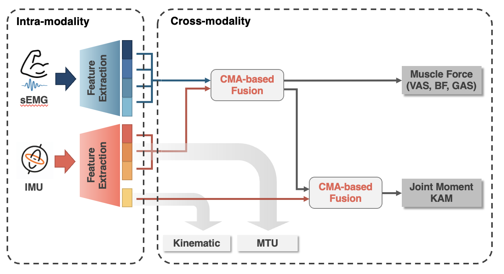

# KneeGuard

This repository is the implementation of the IMWUT 2024 paper

KneeGuard: A Calibration-free Wearable Monitoring System for Knee Osteoarthritis Gait Re-training via Effortless Wearing

KneeGuard is an calibration-free inertial measurement unit (IMU) and surface electromyography (sEMG) based system for gait retraining monitoring.

## Abstract

Gait re-training is an effective approach to slow disease progression and alleviate pain in knee osteoarthritis (KOA) patients. Personalized gait re-training strategies, based on knee loading and muscle forces, have shown promise in improving rehabilitation outcomes. Laboratory systems to monitor these metrics are unsuitable for daily use owing to the complicated setup and high-cost. Recently proposed wearable solutions try to fill this gap, but their in-lab calibration requirement still hinders practical usage. This paper introduces KneeGuard, a calibration-free gait re-training monitoring system that can estimate knee loading and muscle forces via effortless wearing. We identify the main issue of current calibration-needed systems is insufficient biomechanical information retrieval and modeling. To address this, we propose a user-friendly wearable prototype incorporating inertial measurement unit (IMU) and surface electromyography (sEMG) to obtain comprehensive biomechanical information including body geometrical changes and muscle contractions. For modeling, we design a biomechanic-inspired fusion framework based on multi-task learning and cross-modality attention to capture inter-modality biomechanical correlations. Additionally, since precise sensor placement required by current sEMG-based solutions is difficult to locate, we develop a circular sEMG array and propose a spatial-aware feature extraction module, achieving effective biomechanical feature extraction under effortless wearing. We collaborate with a medical center and collect a dataset from 21 KOA patients and 17 healthy subjects at different speeds. Notably, our dataset includes six gait types for KOA gait re-training, making it the first gait dataset with comprehensive re-training strategies. Evaluation demonstrates that KneeGuard achieves an average normalized root-mean-square error (NRMSE) of 9.95% in knee loading estimation and an average NRMSE of 8.75% in the estimation of muscle forces, comparable to the with-calibration results in existing works.

## System Overview


## Dependencies
Our tested environment settings:

- Python version: 3.10
- Pytorch version: 2.4

Dependencies:
- Pytorch: Please follow the [Installation instructions](https://pytorch.org/)
- tqdm, torchmetrics, scipy, and wandb, using pip to install them:

```sh
pip install tqdm torchmetrics scipy wandb
```

## File Description

#### Hardware Design Files
We opened the design file of our hardware, the leg bands.

The files are stored in `hardware` folder.

#### Data Files
We opened a set of samples of one healty subject (S1) and a patient (S27). 

The files are stored in `data` folder.

- data
    - S1_0.5_KO_0.npz: Subject S1, walk at 0.5 m/s with knee valgus gait.
    - S1_0.5_TI1_10.npz: Subject S1, walk at 0.5 m/s with toe in gait.
    - S1_0.5_TO_10.npz: Subject S1, walk at 0.5 m/s with toe out gait.
    - S1_0.5_W_10.npz: Subject S1, walk at 0.5 m/s with wide stride gait.
    - S1_0.8_N_10.npz: Subject S1, walk at 0.8 m/s with normal gait.
    - S27_0.3_KI1_20.npz: Subject S27, walk at 0.3 m/s with knee varus gait.
    - S27_0.3_KO1_20.npz: Subject S27, walk at 0.3 m/s with knee valgus gait.
    - S27_0.3_N_20.npz: Subject S27, walk at 0.3 m/s with normal gait.
    - S27_0.3_TI1_20.npz: Subject S27, walk at 0.3 m/s with toe in gait.
    - S27_0.3_TO1_0.npz: Subject S27, walk at 0.3 m/s with toe out gait.
    - S27_0.3_W_10.npz: Subject S27, walk at 0.3 m/s with wide stride gait.

#### Model Files
We opened two trained model files for testing on S1 and S27.

The files are stored in `model` folder.

- model
    - S1.pt: A trained model whose training data exclude S1's data.
    - S27.pt: A trained model whose training data exclude S27's data.

#### Model Implementation
We opened all the codes used for training our models.

The code files are stored in `src` folder.

However, due to constraints in the data acquisition protocol, we are unable to share all data files, thereby hindering the execution of the model training process. Instructions for testing the model using our provided model file will be detailed in the **Testing** section.

## Testing
The entry point of testing is the file `src/test_model.py`, using follow instruction to test the model on subject S1:

```sh
python -m src.test_model -S S1
```

Please notice that the device configuration is in file `src/config.py` and default is `cpu`.

## Citation

If you find our work useful in your research, please consider citing:

```bibtext
To be done
```